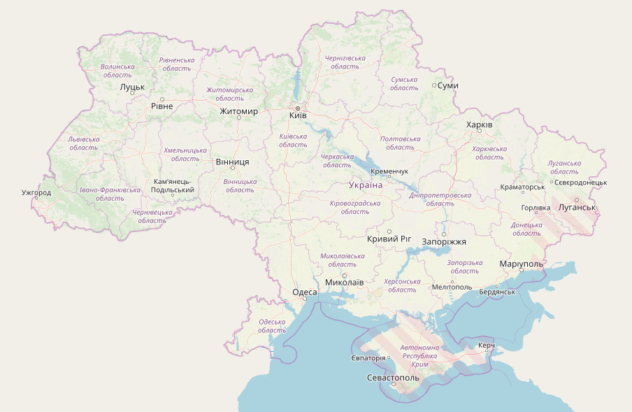

# Introduction

This project is used to serve tiles for `https://tiles.openstreetmap.org.ua/`.

## Usage

Tiles are available by url:

    https://tiles.openstreetmap.org.ua/tile/{z}/{x}/{y}.png
    

Here is an example how to connect tiles to your leaflet map:

    var map = L.map('map').setView([48.959, 32.311], 6);

    L.tileLayer('https://tiles.openstreetmap.org.ua/tile/{z}/{x}/{y}.png', {
        minZoom: 6,
        maxZoom: 18,
        attribution: 'Map data &copy; <a href="https://www.openstreetmap.org/copyright/">OpenStreetMap</a> contributors, <a href="http://opendatacommons.org/licenses/odbl/">ODbL</a>',
        id: 'base'
    }).addTo(map);

Usage is free, but if you expect more than 1000 clients, please, 
contact `shalal545@gmail.com` before using this tile server.

## Self-hosted server

If you want to setup this server on your own hardware, you can follow quickstart of https://github.com/Monstrofil/osm_tileserver_docker
using this repository as reference.

### Installation
1. Clone repository to `/opt/tiles.openstreetmap.org.ua/`.
2. Install nginx and copy configs from `configs` directory to `/etc/nginx`.
3. Download latest `.pbf` dump of Ukraine from 
   `https://github.com/Monstrofil/tiles.openstreetmap.org.ua/releases/latest` (don't forget to untar it using `tar xvf <name>.tar.gz`).
4. Place downloaded and extracted `ukraine-latest-fixed-crimea.osm.pbf` file into `data` folder of this project.
5. Run `docker-compose pull && docker-compose build`
5. Run `./manage.sh import ukraine-latest-fixed-crimea.osm.pbf` in order to start postgis and import osm data into.
6. Run `./manage.sh run` to start webserver (works on 8082 port by default). 
7. Run 
Generated tiles are available by `http://<ip>:8082/osm/{z}/{x}/{y}.png`
   
This project uses https://github.com/Monstrofil/osm_tileserver_docker to
serve tiles, so see that project for detailed instructions.

### Update existing installation
1. Run `git pull`
2. Run `docker-compose pull && docker-compose build`
3. Run `./manage.sh run`

# Credits
- Andrii B for creating script that prepares pbf file